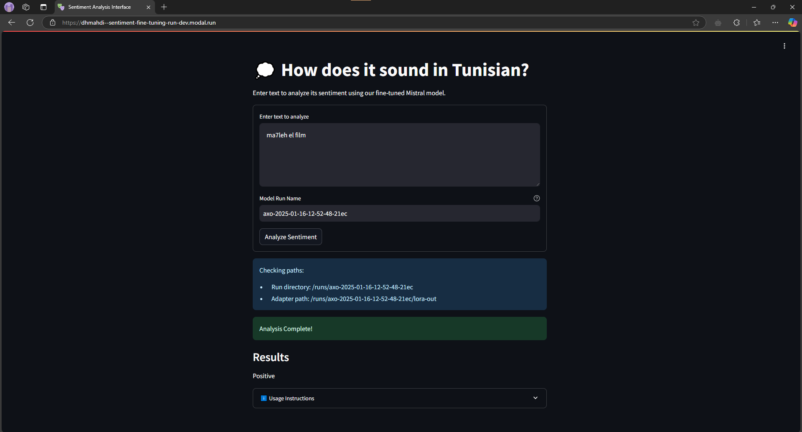

# LLM-Finetune
 A complete solution for finetuning Mistral-7B on Tunisian Arabizi sentiment analysis tasks using Modal cloud infrastructure (You need a Modal account for access) and Axolotl. The project includes training pipeline, model serving, and a Streamlit interface for inference.

# Prerequisites

- Modal account and CLI installed
- Hugging Face account and API token
- Access to GPU resources (A100 or A10g) via Modal

# Installation

## Set up modal

- Grant modal access
```
python -m modal setup
```

- [Create](https://modal.com/secrets) HuggingFace secret

- [Get](https://huggingface.co/mistralai/Mistral-7B-v0.1) access to use the model.

## Clone the repository

```Terminal
git clone https://github.com/dhmahdi/llm-finetune.git
```
```Terminal
cd llm-finetune
```

## Use a virtual environment (optional)

```Terminal
python -m venv venv
```
- MacOS / Linux

```MacOS / Linux
source venv/bin/activate
```
- Windows

```Windows
venv\Scripts\activate
```

## Install dependencies

```Terminal
pip install -r requirements.txt
```

## Start the training job

```
python -m modal run src.train --config=config/mistral7b.yml --data=datasets/data.jsonl
```

## Serve the streamlit app for inference

```
python -m modal serve src/serve_streamlit.py 
```

Or you can deploy if you're not making any changes

```
python -m modal deploy src/serve_streamlit.py 
```

# Dataset Preparation Process

This section describes the process of preparing and validating the sentiment analysis dataset. The process involves three main steps: converting CSV data to JSONL format, cleaning the dataset, and verifying the final data.

## Overview of Scripts

1. `csv_to_jsonl.py` - Converts the raw CSV dataset to JSONL format
2. `clean_dataset.py` - Cleans and validates the converted data
3. `verifydata.py` - Performs final verification of the prepared dataset

## Step 1: CSV to JSONL Conversion

The `csv_to_jsonl.py` script converts the raw CSV dataset into JSONL format, which is more suitable for our sentiment analysis task.

```python
# Example usage
python csv_to_jsonl.py
```

Key features:
- Reads CSV file with header row
- Extracts text and sentiment label columns
- Converts sentiment labels to string format ('0' or '1')
- Creates JSONL output with 'InputText' and 'SentimentLabel' fields
- Handles UTF-8 encoding for proper text processing

## Step 2: Dataset Cleaning

The `clean_dataset.py` script processes the converted JSONL file to ensure data quality and consistency.

```python
# Example usage
python clean_dataset.py
```

Cleaning operations:
- Validates required fields (InputText, SentimentLabel)
- Ensures sentiment labels are in correct format
- Removes invalid entries
- Preserves UTF-8 encoding
- Creates a cleaned output file

## Step 3: Data Verification

The `verifydata.py` script performs final verification of the cleaned dataset.

```python
# Example usage
python verify_dataset.py
```

Verification checks:
- Validates presence of required fields
- Checks data format and structure
- Reports any invalid entries
- Provides verification summary

## Complete Pipeline

To prepare your dataset, follow these steps:

1. Place your raw CSV file in the project directory
2. Run the conversion script:
   ```bash
   python csv_to_jsonl.py
   ```

3. Clean the converted data:
   ```bash
   python clean_dataset.py
   ```

4. Verify the final dataset:
   ```bash
   python verifydata.py
   ```

## File Format Specifications

### Input CSV Format
- Must include header row
- Required columns:
  - Text column (default: column 1)
  - Sentiment label column (default: column 2)
- Labels should be binary (0 or 1)

### Output JSONL Format
Each line contains a JSON object with:
```json
{
    "InputText": "sample text",
    "SentimentLabel": "1"
}
```

## Notes

- All scripts use UTF-8 encoding for file operations
- Invalid entries are logged during processing
- The final dataset can be verified multiple times if needed

# Training configuration
## Configuration
The project uses:

Base model: Mistral-7B-v0.1
Adaptation method: LoRA
Training configuration:

- LoRA rank: 16
- LoRA alpha: 32
- Target modules: All attention and FFN layers
- Sequence length: 512
- Batch size: 8
- Learning rate: 0.0004
- Epochs: 2

You can adjust these hyperparameters in the config file (mistral7b.yml)

## Environment Variables

- GPU_CONFIG: Configure GPU type and count (default: "a100:2" for training, "a10g:1" for inference)
- ALLOW_WANDB: Enable/disable Weights & Biases logging (default: "false")

# Demo
The text entered is "ma7leh el film", which translates as "the movie was good".

<div align="center">
  
</div>

# License
This project uses the Mistral-7B model which is subject to the Apache 2.0 license.